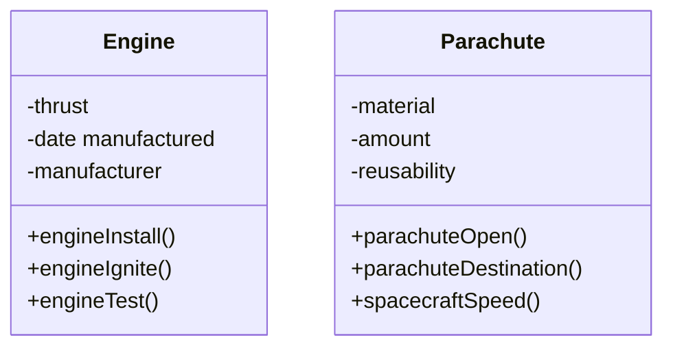
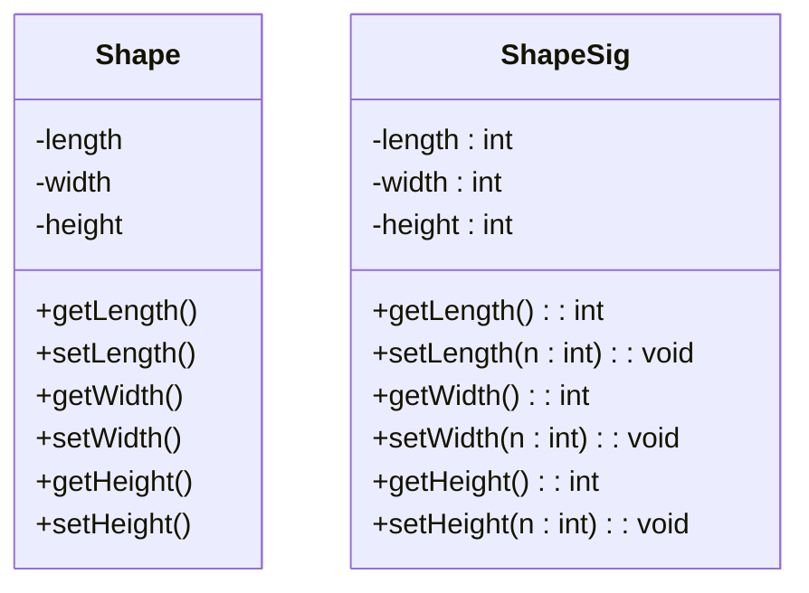
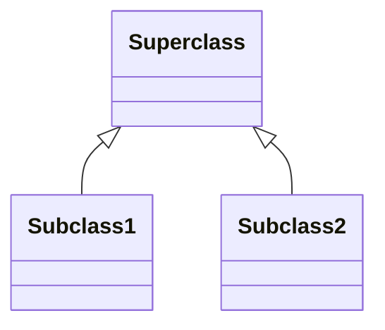

#sample UML diagram for CSC102 by Andrew Lucier 
#andlucie@uat.edu

Create a diagram with 2 classes. Those classes need 3 attributes, 3 methods 
Attributes come before properties or methods 
\+ public, \- private, \# protected 

